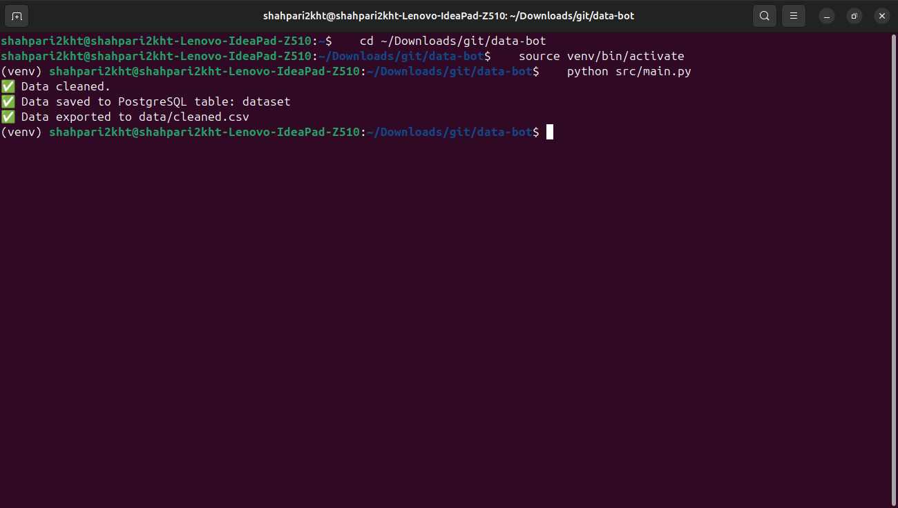

Data Bot
A personal assistant bot for data cleaning, storing in PostgreSQL, and exporting results.

🚀 Features
Clean CSV datasets (remove nulls, standardize formats, etc.)
Store cleaned data into PostgreSQL
Export results as CSV, Excel, or JSON
Configurable table and file names
🛠️ Installation & Setup
Clone the repository

git clone https://github.com/shahpari2kht/data-bot.git

cd data-bot

Create a virtual environment

python3 -m venv venv

source venv/bin/activate

Install dependencies

pip install -r requirements.txt

pip install psycopg2-binary

Setup PostgreSQL

⬤ Create database and user:

CREATE USER shahpari2kht WITH PASSWORD ‘1017190N@nook’;

CREATE DATABASE data_bot_db OWNER shahpari2kht;

GRANT ALL PRIVILEGES ON DATABASE data_bot_db TO shahpari2kht;

⬤ Grant schema permissions:

\c data_bot_db

GRANT ALL PRIVILEGES ON SCHEMA public TO shahpari2kht;

ALTER SCHEMA public OWNER TO shahpari2kht;

▶️ Usage
python src/main.py

Expected output:

✅ Data cleaned.

✅ Data saved to PostgreSQL table: dataset

✅ Data exported to data/cleaned.csv

📂 Project Structure
data-bot/

│── data/

│ ├── sample.csv

│ ├── cleaned.csv

│── src/

│ ├── main.py

│ ├── cleaner.py

│ ├── database.py

│ ├── exporter.py

│── requirements.txt

│── README.md

│── venv/ (excluded in .gitignore)

📸 Example Run

📅 Roadmap
Add query system
Web/CLI interface
Dockerize for deployment

## Project Screenshot

